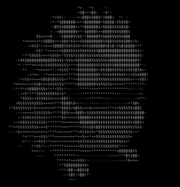
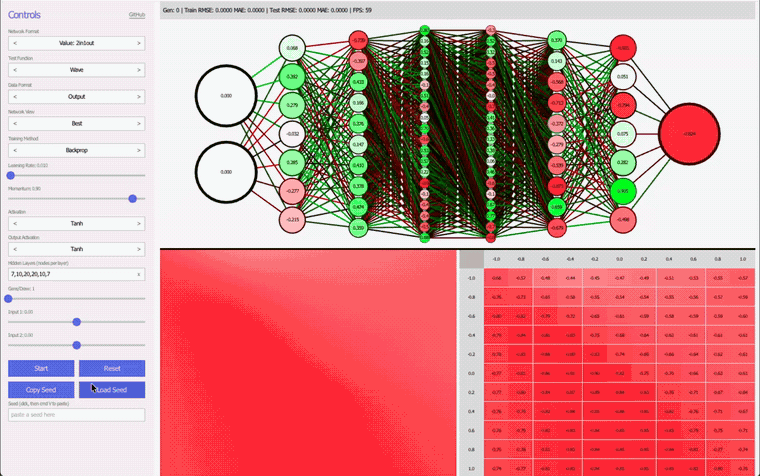
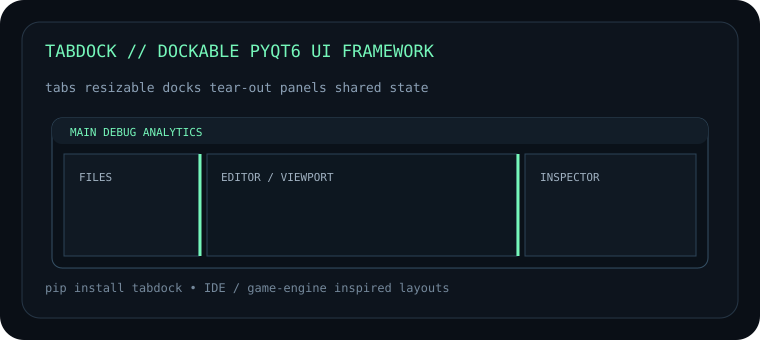
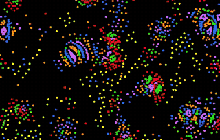

<table>
<tr>
<td width="320" valign="top" align="center">
  
</td>
<td valign="top">

# Tristan Winata 🦔

**Computer Science + Mathematics @ University of Pennsylvania**  
Low-Latency Software · Machine Learning 

[Email](mailto:tristankenshin@gmail.com) · [LinkedIn](https://www.linkedin.com/in/tristan-winata) · [Repositories](https://github.com/HedgehogDubz?tab=repositories)

Outside class, I have worked on computational neuroscience GPU-accelerated clustering pipelines, M&A software, market-data infrastructure, and machine-learning tooling. I specialize in low-level development and building foundational architectures I understand inside and out.
</td>
</tr>
</table>

---

## Featured work

<table>
<tr>
<td width="50%" valign="top">

<a href="https://github.com/HedgehogDubz/Mega-Feed-Handler">
  
</a>

### [Mega Feed Handler](https://github.com/HedgehogDubz/Mega-Feed-Handler)

C++ market-data system that replays IEX DEEP+ traffic over UDP multicast, maintains ordered streams, and recovers packet gaps over TCP. Built around a custom MoldUDP64-style transport with retransmission and recovery.

**C++ · Docker · Networking · UDP multicast · TCP · MoldUDP64**

</td>
<td width="50%" valign="top">

<a href="https://github.com/HedgehogDubz/RiverML-Machine-Learning-Pipeline">
  
</a>

### [RiverML](https://github.com/HedgehogDubz/RiverML-Machine-Learning-Pipeline)

A from-scratch C++/TypeScript ML pipeline with neural networks, genetic training, backpropagation, and an implementation of gradient-boosted decision trees. Models can be trained, saved, and used in real applications in either language.

**C++ · TypeScript · ML/AI**

</td>
</tr>

<tr>
<td width="50%" valign="top">

<a href="https://github.com/HedgehogDubz/TabDock">
  
</a>

### [TabDock](https://github.com/HedgehogDubz/TabDock)

A PyQt6 dockable UI framework inspired by IDEs, game engines, and creative tools. It supports resizable docks, draggable panels, floating windows, reusable layouts, theming, and shared state across panels.

**Python · PyQt6 · UI Frameworks · PyPI**

</td>
<td width="50%" valign="top">
  
## Livestream Particle Life



A particle-life simulation focused on emergent behavior, visual interaction, and live motion. The system shows simple local rules turning into complex large-scale structure in real time.

**C++ · Simulation · Modeling · Livestream**


</td>
</tr>
</table>
## What I'm interested in

```text
low-latency systems
market-data infrastructure
GPU / parallel computing
machine learning internals
developer tools
distributed + networked software
```


