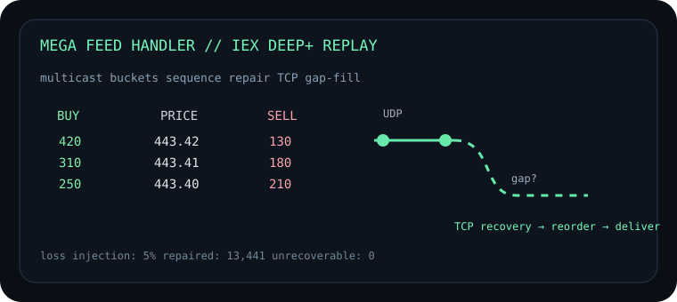
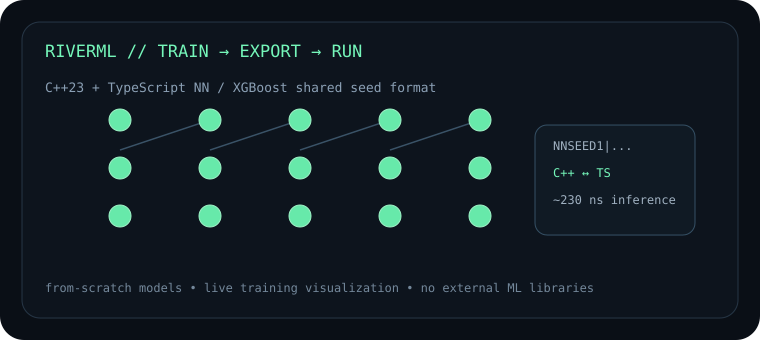

<p align="center">
  
</p>

<h1 align="center">Tristan Winata</h1>

<p align="center">
  <strong>Computer Science + Mathematics @ University of Pennsylvania</strong><br>
  Systems · Machine Learning · Low-Latency Software
</p>

<p align="center">
  <a href="https://hedgehogdubz.github.io">Portfolio</a>
  ·
  <a href="mailto:tristankenshin@gmail.com">Email</a>
  ·
  <a href="https://github.com/HedgehogDubz?tab=repositories">Repositories</a>
</p>

---

I like building software where the implementation details actually matter: networking, performance, visualization, numerical code, GPU acceleration, and tools that make complicated systems easier to understand.

At Penn, I study computer science and mathematics. Outside class, I've worked on computational neuroscience pipelines, M&A software, market-data infrastructure, and machine-learning tooling. I usually gravitate toward projects where I can build the core system myself instead of hiding it behind a large framework.

### Featured work

<table>
<tr>
<td width="50%" valign="top">

<a href="https://github.com/HedgehogDubz/Mega-Feed-Handler">
  
</a>

#### [Mega Feed Handler](https://github.com/HedgehogDubz/Mega-Feed-Handler)

C++ market-data system that replays IEX DEEP+ traffic over UDP multicast, maintains ordered streams, and recovers packet gaps over TCP. Built around a custom MoldUDP64-style transport with retransmission and recovery.

**C++ · UDP multicast · TCP · pcapng · Docker**

</td>
<td width="50%" valign="top">

<a href="https://github.com/HedgehogDubz/RiverML-Machine-Learning-Pipeline">
  
</a>

#### [RiverML](https://github.com/HedgehogDubz/RiverML-Machine-Learning-Pipeline)

A from-scratch C++/TypeScript ML pipeline with neural networks, genetic training, backpropagation, and XGBoost. Models export to a shared seed format so a model trained in one language can run unchanged in the other.

**C++23 · TypeScript · Neural Networks · XGBoost**

</td>
</tr>

<tr>
<td width="50%" valign="top">

<a href="https://github.com/HedgehogDubz/TabDock">
  
</a>

#### [TabDock](https://github.com/HedgehogDubz/TabDock)

A PyQt6 dockable UI framework inspired by IDEs, game engines, and creative tools. It supports resizable docks, draggable panels, floating windows, reusable layouts, theming, and shared state across panels.

**Python · PyQt6 · UI Frameworks · PyPI**

</td>
<td width="50%" valign="top">

### What I'm interested in

```text
low-latency systems
market-data infrastructure
GPU / parallel computing
machine learning internals
developer tools
distributed + networked software
```

I care a lot about understanding why a system is fast, slow, correct, or broken — not just getting it to run.

</td>
</tr>
</table>

### A few things I've worked on

- **Computational neuroscience:** migrated spike-sorting / clustering workloads toward GPU-accelerated workflows and worked with large electrophysiology datasets.
- **Market infrastructure:** reliable multicast, packet sequencing, retransmission buffers, order-book reconstruction, and loss recovery.
- **Machine learning:** neural networks and boosted trees implemented from scratch, with live training visualization and portable model serialization.
- **Developer tooling:** desktop/web interfaces, dockable UI systems, Dockerized workflows, CI, and cross-language pipelines.

<p align="center">
  <sub>The hedgehog above is rendered as ASCII from my STL model. X starts at 90° and the model rotates around world Z.</sub>
</p>
